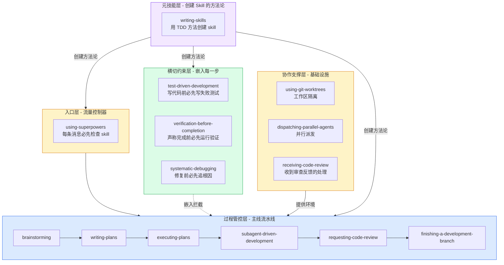

# 序章：Superpowers 解决了什么问题？

## 一个日常场景

你让 AI 帮你实现一个登录功能。AI 说"好的"，然后：

1. 直接写代码 — 没有设计、没有计划、没有测试
2. 写到一半发现方向错了 — 删掉重来
3. 代码能跑了 — AI 说"完成了"
4. 你一试 — 崩溃了

**这不是 AI 能力的问题。这是缺少工作流程约束。**

## 为什么 AI 需要 Skill

AI agent 被训练为"有帮助的"——它天然想做事情。但这意味着它容易：

- **跳过设计直奔实现**：因为写代码比问问题更快
- **声称完成而不验证**：因为"看起来应该可以了"
- **遇到 bug 就猜原因修症状**：因为这样更快（短期）
- **找借口绕过规则**：因为"这次情况特殊"

这些不是 AI 的错——是 AI 在设计时没有被约束。就像你不会让一个新入职的工程师在没有 code review、没有 CI、没有设计评审的情况下提交代码一样。

## Skill 是什么

**Skill 是给 AI agent 的行为约束程序。** 它不是"参考文档"，它是：

| 不是 | 是 |
|------|---|
| "建议你这样做" | "你必须这样做" |
| 建议性的指引 | 铁律 + 防绕过设计 |
| 给人读的文档 | 给 AI agent 读并**执行**的程序 |
| 一次性提示词 | 持久化、可被发现、可迭代的约束 |

## Superpowers 体系一览

Superpowers 提供了 14 个相互协作的 skill，覆盖了从"我有一个想法"到"代码合入主分支"的完整流程。它们不是 14 个独立工具，而是一个**四层架构的精妙系统**：

> **阅读提示**：本文按"由浅入深"组织——先用架构总览建立全局认知，再逐层深入，最后讲设计模式和元技能。建议按顺序阅读，每章约 5-10 分钟。
