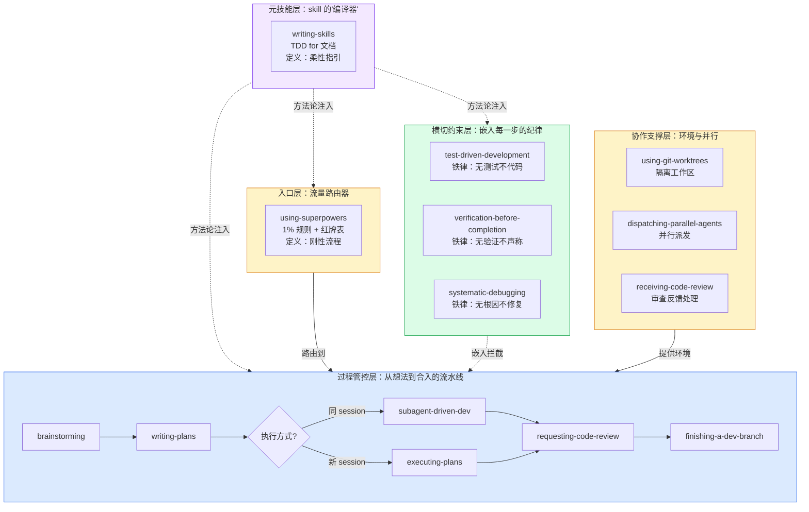
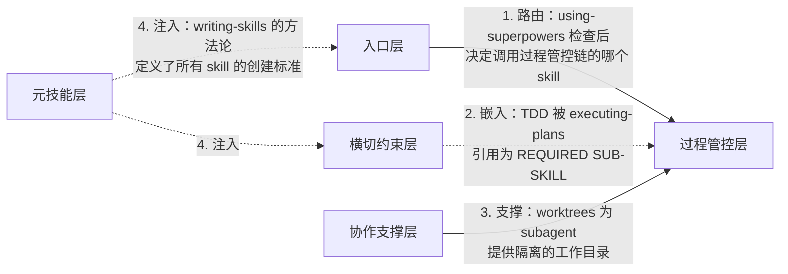

# 第一章：架构总览 — 四层体系

## 为什么是"层"而不是"列表"

把 14 个 skill 看作平铺的列表，就像把一栋建筑的砖块、钢筋、水管、电线全部摊在地上说"这就是这栋楼"——你看到了一堆材料，但看不到结构。

Superpowers 的真实结构是**四层**，每层有不同的职责和关系：

## 每层一句话

| 层 | 核心职责 | 关键设计 |
|---|---------|---------|
| **元技能层** | 定义"如何创建 skill"的方法论 | 自指：writing-skills 是用自己教的方法创建的 |
| **入口层** | 拦截每条消息，决定调用哪个 skill | 1% 规则：哪怕 1% 可能也要调用 |
| **过程管控层** | 从想法到代码合入的完整流水线 | 确定性路由：每个 skill 明确指定下一个 |
| **横切约束层** | 在流水线的每一步强制执行纪律 | 铁律 + 理性化表 + 红牌列表 |
| **协作支撑层** | 提供隔离和并行执行的基础能力 | 不直接约束行为，而是创造正确的工作环境 |

## 层与层之间的四种关系

**关键洞察**：这四种关系完全不同。当前图谱中的三条连线（顺序依赖/横切嵌入/理念引用）把本质上不同的关系混为一谈。真实的设计中：

- **路由** = 入口层到过程层：A 在运行时会自动调用 B
- **嵌入** = 约束层到过程层：B 在执行中**必须**遵循 A 的规则
- **支撑** = 协作层到过程层：B 依赖 A 提供的环境才能正常运行
- **注入** = 元技能到所有：A 的方法论定义了 B 应该如何被设计和创建

这就是为什么平铺式图谱无法传达核心架构——它抹平了这些本质不同的关系类型。

---

> **下一章**：[过程管控链](#第二章过程管控链--流水线)——看看从想法到代码合入，每一步是如何被精确设计的。
