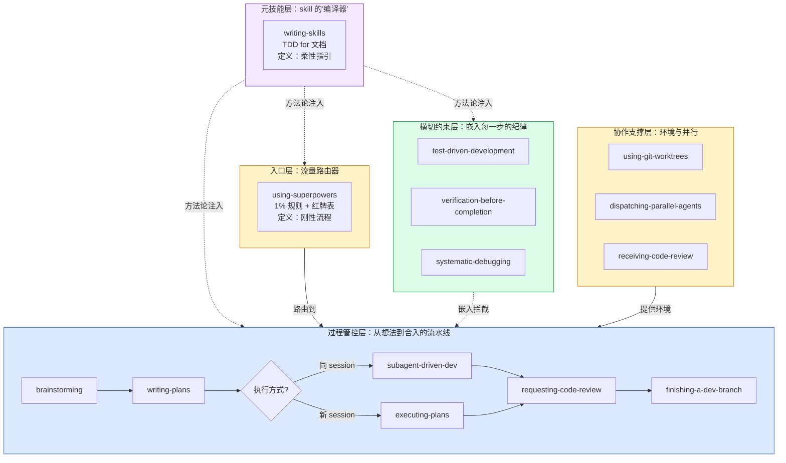
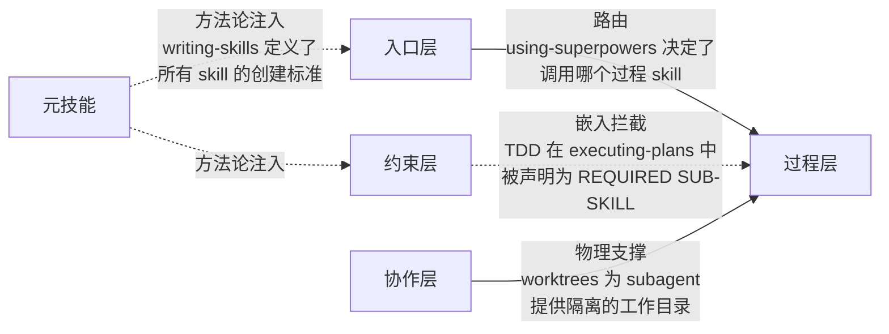

# 第一章：架构总览 — 四层体系

## 为什么是"层"而不是"列表"

把 14 个 skill 看作平铺的列表，就像把一栋建筑的砖块、钢筋、水管、电线全部摊在地上说"这就是这栋楼"——你看到了一堆材料，但看不到结构。

Superpowers 的真实结构是**四层**，每层的职责和关系类型完全不同：



## 每层的证据：从源码看分层

空口无凭。以下是源码中直接证据：

### 入口层 ← `using-superpowers/SKILL.md` 第一段

```markdown
<EXTREMELY-IMPORTANT>
If you think there is even a 1% chance a skill might apply to what you are doing,
you ABSOLUTELY MUST invoke the skill.

IF A SKILL APPLIES TO YOUR TASK, YOU DO NOT HAVE A CHOICE. YOU MUST USE IT.
</EXTREMELY-IMPORTANT>
```

**分析**：`<EXTREMELY-IMPORTANT>` 不是一个装饰标签——它利用 AI agent 对强标签的敏感性来强制改变行为优先级。正常的 agent 流程是"理解需求 → 开始行动"，这个标签在流程的最前端插入了一个**强制检查点**："先检查有没有 skill 适用"。

注意措辞的重复强化：
- "even a 1% chance" — 消除了"可能不需要"的判断空间
- "ABSOLUTELY MUST" — 全大写，不可谈判
- "YOU DO NOT HAVE A CHOICE" — 直接否定 agent 的选择权
- "This is not negotiable. This is not optional." — 两句同义重复，杜绝解释空间

### 过程层 ← `brainstorming/SKILL.md` 结尾

```markdown
**The terminal state is invoking writing-plans.**
Do NOT invoke frontend-design, mcp-builder, or any other implementation skill.
The ONLY skill you invoke after brainstorming is writing-plans.
```

**分析**：这是确定性路由的实现。"The terminal state" 是一个明确定义的概念——brainstorming 完成后只有一个合法的下一步：writing-plans。还显式禁止了常见的错误跳转（frontend-design、mcp-builder 等）。

### 约束层 ← `test-driven-development/SKILL.md` 铁律

```markdown
NO PRODUCTION CODE WITHOUT A FAILING TEST FIRST

Write code before the test? Delete it. Start over.

**No exceptions:**
- Don't keep it as "reference"
- Don't "adapt" it while writing tests
- Don't look at it
- Delete means delete
```

**分析**：铁律 + 逐条关闭漏洞。不只是说"必须有测试"——而是说"没测试的代码删掉"，然后封堵了所有保留代码的借口。"Don't look at it" 最极端——不只是不能保留，连看都不能看，因为看了就会影响后面的实现。

### 协作层 ← `subagent-driven-development/SKILL.md` 集成声明

```markdown
**Required workflow skills:**
- superpowers:using-git-worktrees - Ensures isolated workspace
- superpowers:writing-plans - Creates the plan this skill executes
- superpowers:requesting-code-review - Code review template for reviewer subagents
- superpowers:finishing-a-development-branch - Complete development after all tasks
```

**分析**：subagent-driven-development（过程层 skill）显式声明了它依赖协作层 skill（worktrees）和过程层其他 skill。这种**声明的依赖关系**就是层与层之间的接口定义。

## 层间关系的四种类型



**关键洞察**：四种关系本质不同：
- **路由** = 运行时决策：A 决定下一步调用 B
- **嵌入** = 编译时引用：C 的规则被 B 的代码显式引用
- **支撑** = 物理依赖：B 需要 D 提供的环境才能运行
- **注入** = 创造时约束：E 定义了 A/C 在创建时必须遵循的方法论

---

> **下一章**：[过程管控链](#第二章过程管控链--流水线)——从 brainstorming 的 HARD-GATE 到 finishing 的结构化合入，每步都从源码深挖。
