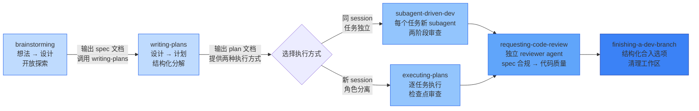
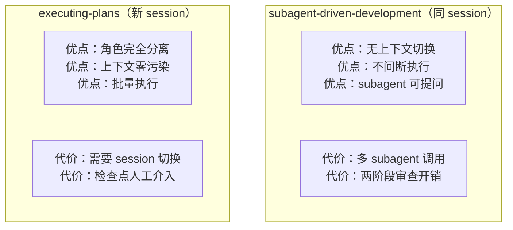
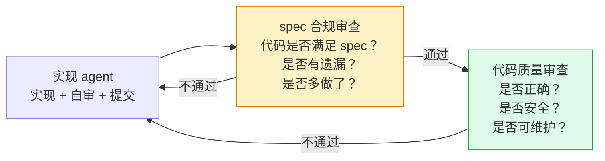

# 第二章：过程管控链 — 从想法到合入的流水线

## 设计哲学

过程管控链是 superpowers 的主干。它的核心设计理念：

1. **确定性路由**：每个 skill 的"终点"明确指定下一个 skill，agent 不会迷失
2. **逐步缩小自由度**：从 brainstorming（最开放）到 finishing（最确定），每步约束更精确
3. **隔离设计与执行**：设计的人不执行，执行的人不设计——角色分离



## 每一步的设计精要

### 1. brainstorming — "把想法变成设计"

**核心机制**：`<HARD-GATE>` 标签 —— 在设计被用户批准前，**禁止调用任何实现 skill、禁止写任何代码**。

```
"What should we build?" ← brainstorming 回答的问题
"How should we build it?" ← writing-plans 回答的问题
"Let's build it!"       ← 在这之前不能说的
```

**为什么需要硬阻断**：AI agent 被训练为"有帮助的"——它听到需求就想立刻写代码。HARD-GATE 是对这种冲动的强制刹车。

**关键设计细节**：
- 一次只问一个问题、多用选择题——降低用户的认知负担
- 提出 2-3 种方案及权衡——不给唯一答案，给选择
- 每节设计确认后再继续——增量验证，避免大方向错误
- 输出到 `docs/superpowers/specs/YYYY-MM-DD-topic-design.md`——留下可追溯的决策记录

### 2. writing-plans — "把设计变成可执行计划"

**核心机制**：零上下文假设 —— 写计划时假设执行者**完全不了解项目**。

```
"假设他们是有经验的开发者，但对我们的工具和问题域一无所知。"
```

**为什么需要零上下文**：因为执行 plan 的可能是另一个 session 的 agent、或者是 subagent——它没有你的上下文。plan 必须是自包含的指令集。

**关键设计细节**：
- 每个 task 是 2-5 分钟的一个动作（"写失败测试" → "运行验证失败" → "写最小实现" → "运行验证通过" → "提交"）
- 禁止占位符（TODO、TBD、"适当补充"）——每一步都必须有完整代码和精确命令
- 文件结构设计先于任务分解——先把模块边界锁定，再拆分任务
- 输出到 `docs/superpowers/plans/YYYY-MM-DD-feature.md`

### 3. 两种执行方式的设计博弈



**选择标准**：
- 任务独立 + 想快 → subagent-driven-development
- 任务耦合 + 想隔离 → executing-plans

### 4. subagent-driven-development — "每个任务一个新大脑"

**核心洞察**：上下文污染比上下文重复更危险。

每个 subagent 从零上下文开始——它只看到你为这个任务准备的 prompt。这意味着：
- 前面任务的决策错误不会传递
- 每个 agent 的思考是独立的
- 审查 agent 的视角是新鲜的

**两阶段审查（关键设计）**：



**为什么先 spec 后代码**：先看代码后看 spec → reviewer 会用"代码看起来合理"替代"代码做了该做的事"。必须先建立"该做什么"的基准。

### 5. requesting-code-review — "独立 agent 的独立视角"

- 派遣专门的 code-reviewer agent，不继承实现 agent 的思维过程
- 模拟人类 code review 的核心价值——不同视角看到不同问题

### 6. finishing-a-development-branch — "给合入提供结构化选项"

不直接问"你想怎么处理这个分支？"而是给出 4 个具体选项：
- 直接合并 / 创建 PR / 暂存清理 / 放弃

**设计用心**：减少决策疲劳。开放式问题让 agent 和人都容易决策瘫痪。

---

> **下一章**：[横切约束层](#第三章横切约束层--三个铁律)——如果没有这些约束，上面的流水线每步都会出问题。
