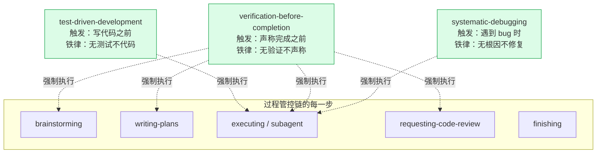
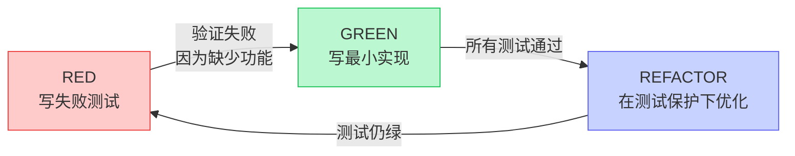
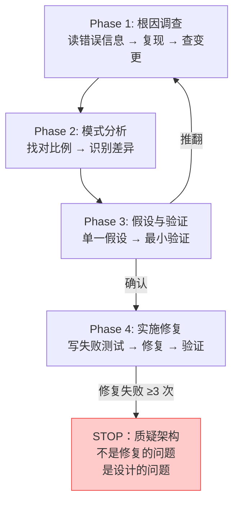
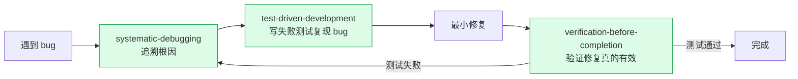

# 第三章：横切约束层 — 三个铁律

## 为什么需要横切约束

过程管控链定义了"做什么"——但它**不保证过程的质量**。就像一条装配线：可以走完所有工位，但每个工位可能偷工减料。

横切约束层的三个 skill 解决的就是这个问题。它们不是独立的——**它们嵌入在过程链的每一步**，当特定条件触发时强制介入。



## test-driven-development — 无测试不代码

### 铁律

```
NO PRODUCTION CODE WITHOUT A FAILING TEST FIRST
```

### RED-GREEN-REFACTOR 循环



### 为什么必须先看测试失败

"如果测试一开始就通过了——它在测什么？"

- 可能测了已有功能（不是你新增的）
- 可能测试写错了
- 可能测试没覆盖目标场景

测试先失败的证据 = 这个测试真正在验证"缺失的功能被补上了"。

### 防绕过设计

这个 skill 有整个 superpowers 体系中最严格的防绕过措施：

```
写了代码但没写测试？删掉。重来。

没有例外：
- 不能保留为"参考"
- 不能在写测试时"修改"它
- 不能看它
- 删掉意味着删掉
```

**设计意图**：agent 在压力下会把"暂时保留代码作为参考"当成合规的捷径。逐条禁止确保没有灰色地带。

## verification-before-completion — 无验证不声称

### 铁律

```
NO COMPLETION CLAIMS WITHOUT FRESH VERIFICATION EVIDENCE
```

### 核心机制：Gate Function

```
声称完成之前的 5 步检查：
1. 识别：什么命令能证明这个声称？
2. 运行：完整运行（新鲜，不用缓存）
3. 阅读：完整输出，检查退出码，数失败数量
4. 验证：输出真的证实了声称吗？
   - 否 → 报告实际状态 + 证据
   - 是 → 报告声称 + 证据
5. 只有这时才能做声称
跳过任何一步 = 欺骗
```

### 这个 skill 的独特之处

它源自 24 条失败记忆——用户说"我不信你"。这是信任破裂后的纠正机制。它不是"改进流程"，而是**重建信任**。

**禁止的措辞**："应该可以了""看起来没问题""上次跑通了"。这些词被定义为红旗——一出现就触发强制验证。

## systematic-debugging — 无根因不修复

### 铁律

```
NO FIXES WITHOUT ROOT CAUSE INVESTIGATION FIRST
```

### 四阶段流程



### 3 次修复失败规则

**如果尝试了 3 次修复都失败——不是修复手段的问题，是架构的问题。** 这是对抗"打地鼠"调试的关键设计——强迫 agent 在反复失败时跳出来重新审视架构。

## 三个铁律的协同

这三个 skill 形成了一个**质量闭环**：



**闭环的意义**：没有横向约束，bug 的修复流程是"发现 → 猜 → 修 → '应该好了'"。有了三个铁律，流程是"发现 → 调查根因 → 写测试复现 → 最小修复 → 运行验证 → 确认通过"。

---

> **下一章**：[设计模式目录](#第四章设计模式目录--八个贯穿模式)——这些 skill 复用了哪些相同的设计模板？
