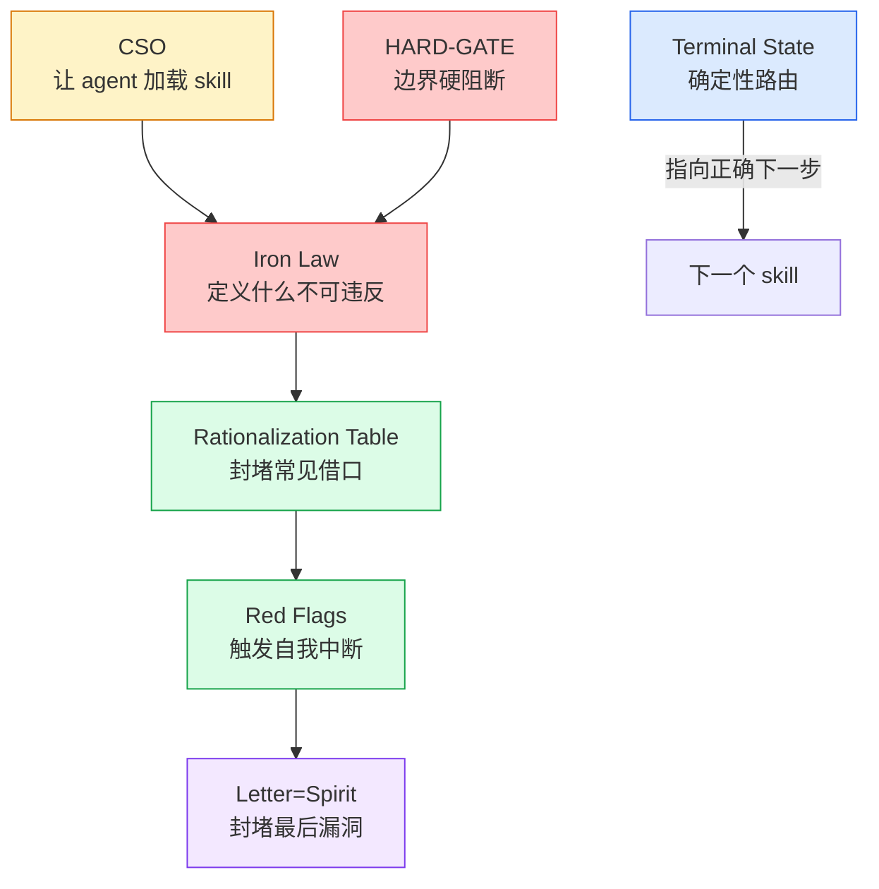

# 第四章：设计模式目录 — 八个贯穿模式

读完前三章，你可能注意到了：不同的 skill 中有很多相似的结构。这不是巧合——**这是一套可复用的设计模式**。

理解这些模式，你就掌握了"如何创建 skill"的核心知识。它们正是 writing-skills 教的方法论的实际应用。

---

## 模式 1：Iron Law（铁律）

**形态**：用全大写 ASCII art 声明一条不可谈判的规则。

```
NO PRODUCTION CODE WITHOUT A FAILING TEST FIRST   (TDD)
NO COMPLETION CLAIMS WITHOUT FRESH VERIFICATION EVIDENCE   (VBC)
NO FIXES WITHOUT ROOT CAUSE INVESTIGATION FIRST   (debugging)
NO SKILL WITHOUT A FAILING TEST FIRST   (writing-skills)
```

**设计意图**：
- 视觉冲击力——全大写 + 等宽字体 + 框起来，agent 不会"略过"
- 精确定义了"什么是违规"——消除歧义
- 可验证——每一条都有明确的"违反条件"

**使用时机**：当你的 skill 需要强制执行某个行为约束时，用铁律。不是所有 skill 都需要——柔性指引类（如 brainstorming）不用。

---

## 模式 2：Rationalization Table（理性化表）

**形态**：表格，左栏是"口头借口"，右栏是"现实反驳"。

| 借口 | 现实 |
|------|------|
| "太简单不需要测试" | 简单代码也会坏。测试 30 秒。 |
| "我手动测过了" | 手动测试不可重复。没有记录。 |
| "部署后再测试" | 不测试的 skill 浪费更多时间修。 |
| "这次不一样因为..." | 每次都不一样，每次都一样坏。 |

**设计意图**：
- Agent 在理性化时产生的是**文字思维**——恰好匹配表左栏
- 看到自己的念头被列入表 = 自我识别"我在理性化"
- 不仅是给人看的，更是给 agent **自我检查**用的

**核心技巧**：借口必须来源于真实的压测记录。凭空想象的借口没有说服力。

---

## 模式 3：Red Flags List（红牌列表）

**形态**：一个清单，标题是 "Red Flags - STOP and Start Over"。

```
Red Flags - STOP and Start Over:
- Code before test
- "I already manually tested it"
- "Tests after achieve the same purpose"
- "It's about spirit not ritual"
- "This is different because..."

All of these mean: Delete code. Start over with TDD.
```

**设计意图**：
- 比理性化表更进一步——不仅是"这个借口不成立"，而是"这个念头出现时立刻停下来"
- 最后一句给出绝对指令：所有红牌都意味着同一个动作 → 删掉重来
- 不给解释空间——"all of these mean" 杜绝逐一辩论

---

## 模式 4："Letter = Spirit" 声明

**形态**：一句话，位于 skill 的开头部分。

> "Violating the letter of the rules is violating the spirit of the rules."

**设计意图**：

这是整个防理性化体系中最关键的一句话。它切断了一类最常见的绕过方式：

```
Agent: "我在遵循规则的精神——虽然跳过了写测试，但我的代码质量很高。"
Skill: "违反字面就是违反精神。"
Agent: "......"
```

**为什么有效**：这句话利用了 agent 对自身推理能力的限制——它无法对"你是否真的在遵循精神"做出值得信赖的 meta 判断。一旦字面 = 精神的等式建立，"我只是在遵循精神"就不再是合法借口。

---

## 模式 5：HARD-GATE（硬阻断）

**形态**：`<HARD-GATE>` 标签，在关键边界处阻止 agent 行动。

```xml
<HARD-GATE>
Do NOT invoke any implementation skill, write any code, scaffold any project,
or take any implementation action until design is approved.
</HARD-GATE>
```

**设计意图**：
- Agent 的默认行为是"做事情"——它对"停下来先想"有天生的抗拒
- HARD-GATE 用强烈的视觉格式 + 全大写 + 否定句式来打断这种模式
- 只在最关键的边界使用（设计→实现、测试前→写代码）——滥用会削弱效果

---

## 模式 6：CSO（Claude Search Optimization）

**形态**：在 `description` 字段中**只写触发条件，不写工作流摘要**。

```yaml
# 错误：包含了流程摘要
description: Use for TDD - write test first, watch it fail, write minimal code, refactor

# 正确：只有触发条件
description: Use when implementing any feature or bugfix, before writing implementation code
```

**为什么这个模式至关重要**：

实测发现：当 description 包含工作流摘要时，agent 会直接按 description 的摘要行动，**而不加载 skill 正文**。TDD skill 被绕过——agent 写了一个测试（任意测试），说"我完成了 RED-GREEN"。

当 description 只有触发条件时，agent 必须加载 skill 才能知道要做什么——然后 skill 正文中的完整约束就生效了。

**一句话概括**：Description 是"我该不该读这个 skill"的判断条件，不是"这个 skill 做什么"的摘要。把 description 想象成索引卡片，不是 TL;DR。

---

## 模式 7：Terminal State（终结状态路由）

**形态**：每个过程 skill 的末尾明确指定下一步调用哪个 skill。

```
brainstorming → "The terminal state is invoking writing-plans. Do NOT invoke any other skill."
writing-plans → 提供两种选项，都指向执行类 skill
subagent-driven-development → "Use superpowers:finishing-a-development-branch"
```

**设计意图**：
- Agent 完成一个步骤后的自然冲动是"我在做什么？"——终端状态告诉它确切答案
- 确定性路由 = agent 不会迷失或跳过步骤
- 同时也防止 agent 调用错误的下一个 skill

---

## 模式 8：Subagent Isolation（子 Agent 隔离）

**形态**：每个 subagent 从零上下文开始，不继承主 session 的任何信息。

```
"Fresh subagent per task. They should never inherit your session's context or history."
```

**核心洞察**：上下文污染比上下文重复更危险。

- 前面任务的错误决策会污染后续任务的 agent 判断
- 上下文中的无关信息会干扰 agent 的专注度
- 自包含的 prompt 虽然看起来"冗余"，但是隔离的必要代价

---

## 模式之间的关系

这些模式不是独立的——它们互相增强：



**流程**：CSO 确保 agent 加载 skill → Iron Law 定义规则边界 → Rationalization Table 封堵常见借口 → Red Flags 触发自我中断 → Letter=Spirit 封堵最后的"精神 vs 字面"绕过。HARD-GATE 在关键边界提供硬阻断。Terminal State 确保流程正确衔接。

**掌握这八个模式 = 掌握了创建 skill 的核心语言。**

---

> **下一章**：[元技能深度走读](#第五章元技能深度走读--writing-skills)——writing-skills 如何将 TDD 方法应用于文档创建？它是上述所有模式的"模板"。
