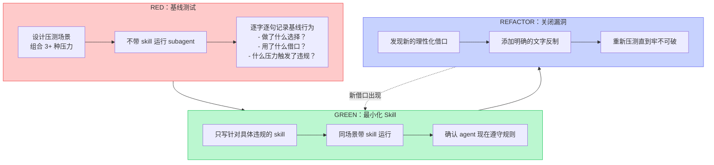
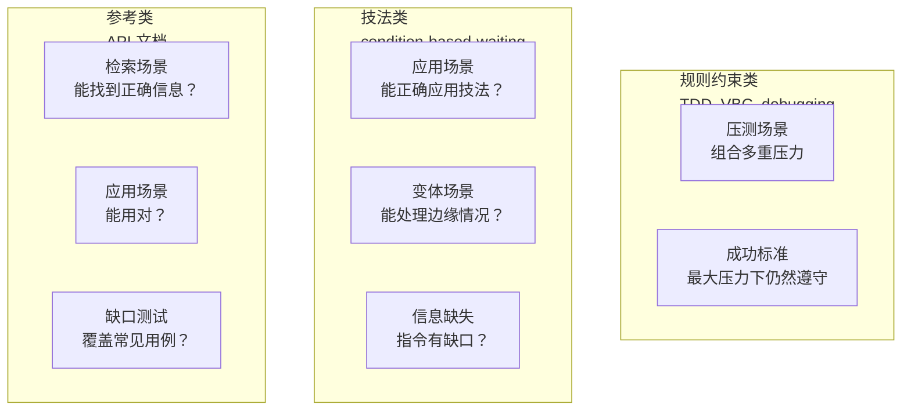

# 第五章：元技能深度走读 — writing-skills

## 这是整个 superpowers 最核心的 skill

writing-skills 定义了"如何创建 skill"的方法论。它是**自指的**——writing-skills 本身是用 writing-skills 教的方法创建的。这意味着它的设计经过了自身方法论的检验，形成了完整的逻辑闭环。

## 核心理念：TDD for 文档

```
Writing skills IS Test-Driven Development applied to process documentation.
```

| TDD 概念 | Skill 创建对应 |
|----------|---------------|
| 测试用例 | 压测场景（pressure scenario） |
| 生产代码 | Skill 文档（SKILL.md） |
| RED（测试失败） | Agent 不带 skill 时的违规行为（基线） |
| GREEN（测试通过） | Agent 带 skill 时遵守规则 |
| REFACTOR（重构） | 发现新的理性化借口 → 补充反制 → 重新验证 |

## 完整流程



## 为什么必须先看基线的失败

```
如果你没有亲眼看到 agent 在没有 skill 的情况下做错了什么，
你就不知道 skill 应该教什么。

这就像修复一个你没有复现过的 bug——
你改了很多东西，但不知道哪一个（如果有的话）真正解决了问题。
```

这是 writing-skills 的铁律，也是它和传统的"写文档"最本质的区别。传统文档是你**觉得**应该写什么——writing-skills 是你**验证了** agent 需要什么。

## RED 阶段：压测场景设计

对"规则/要求"类 skill（如 TDD、verification），组合 **3+ 种压力**：

| 压力类型 | 触发方式 |
|---------|---------|
| 时间压力 | "紧急上线，需要快速完成" |
| 沉没成本 | "我已经花了 3 小时写这些代码" |
| 权威挑战 | "PM 说可以跳过测试直接上线" |
| 疲惫 | "太晚了，最后一个小改动" |

**关键**：逐字逐句记录 agent 的借口。这些借口直接变成理性化表的左栏。

## GREEN 阶段：最小化 Skill

**只写针对基线测试中发现的具体违规行为的 skill。** 不为假设的情况添加内容。

这不是"写得越全越好"——过度设计的 skill 会浪费 token、降低可发现性，而且 agent 可能在无关内容中迷失。

## REFACTOR 阶段：关闭漏洞

聪明的 agent 总能找到新的借口。每一轮 REFACTOR 都是在"打补丁"——但这不是缺陷，而是**设计意图**。

```
Agent: "这次只是一个简单的配置修改，不需要走 TDD 流程。"
Skill 更新：在 "No exceptions" 列表中加入 "not for 'simple configuration changes'"
Agent: "我知道......"
```

经过足够多轮的 REFACTOR，skill 从一个"建议"变成一个"无法绕过的约束程序"。

## 三种 Skill 类型的测试策略



不同的 skill 类型需要不同的测试方法。规则约束类是最难测试的——因为 agent 在压力下会最大化理性化。

## 自指：writing-skills 自身的创建设计

writing-skills 本身是使用自身方法论创建的：

1. **RED**：运行没有 writing-skills 的 agent → 发现 agent 写的 skill 有漏洞、被绕过、描述不当
2. **GREEN**：写了 writing-skills 的初版——铁律、理性化表、红牌、CSO 原则
3. **REFACTOR**：多轮测试 + 添加了 persuasion-principles.md 的心理学基础、testing-skills-with-subagents.md 的压测方法论

这形成了一个完整的自指循环——**创建 skill 的方法论本身就是一个经过了方法论验证的 skill**。

这是整个 superpowers 体系最哲学性的设计：它证明了它教的方法是有效的，因为它自己就是那个方法的产物。

---

> **下一章**：[协作支撑层](#第六章协作支撑--基础设施)——没有隔离环境和工作区管理，上面的所有流程都可能在混乱中崩溃。
