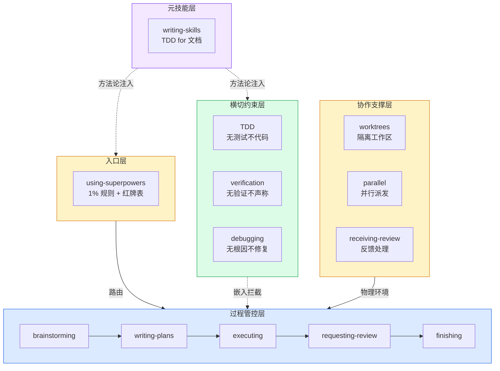

# 第六章：协作支撑 — 基础设施的源码分析

前三层（入口、过程、约束）是"告诉 agent 做什么"。第四层不同——它提供**物理环境**：隔离的工作区、并行的能力、反馈响应的规范。

---

## using-git-worktrees — 隔离而非切换

### 从 subagent-driven-development 看依赖

```markdown
**Required workflow skills:**
- superpowers:using-git-worktrees - Ensures isolated workspace (creates one or verifies existing)
```

**为什么 worktree 是前置条件**：subagent-driven-development 为每个 task 派发一个新的 subagent。如果所有 subagent 共享同一个工作目录，文件系统级别的冲突不可避免。Worktree 给每个 agent 提供独立的物理空间。

### 核心理念

不是在不同分支间切换（stash → checkout → pop），而是让不同分支**同时存在**在不同的目录中。这从根本上消除了 stash/pop 的痛点。

---

## dispatching-parallel-agents — 独立任务并行

### 核心条件

```markdown
When facing 2+ independent tasks that can be parallelized without shared state.
```

**关键约束**："without shared state"——两个任务即使处理同一个文件的不同区域，如果有合并冲突的风险，就不是真正独立的。

### 自包含 prompt

```markdown
Craft self-contained prompts for each agent — they start with zero context,
so each prompt must contain ALL information needed to complete the task.
```

**设计代价**：自包含 prompt 看起来"冗余"——但这是隔离的必要代价。一个需要共享上下文才能完成的任务就是不能并行的任务。

---

## receiving-code-review — 技术严谨 > 表面和谐

### 源码核心

```markdown
When receiving code review feedback:
1. First understand: what problem is this feedback trying to solve?
2. If feedback is unclear → ask for clarification
3. If feedback has issues → push back with evidence
4. Only then implement
5. After implementation, verify the fix addresses the original concern
```

### 赋予 agent "反驳权"

```markdown
Do NOT blindly implement feedback. Receiving-code-review empowers the agent to
question and push back — not blindly execute every review comment.
```

**这是这个 skill 最独特的设计**：它给了 agent 反驳审查意见的权利。大多数 agent 的默认行为是"用户/审查者说了什么就改什么"——但实际上审查者也可能犯错。Technical rigor over superficial harmony。

---

## 全貌：四层协同架构



---

## 总结：你现在知道了什么

1. **源码目录**：14 个 SKILL.md + 支持文件，分为四大分组
2. **四层架构**：入口 → 过程 → 约束 → 协作，每层有不同职责和关系类型
3. **过程管控链**：6 个 skill 的确定性路由流水线，每步有 `<HARD-GATE>`、checklist、terminal state
4. **三个铁律**：TDD（无测试不代码）、verification（无验证不声称）、debugging（无根因不修复），每个有完整的防绕过设计
5. **八个设计模式**：Iron Law、理性化表、红牌列表、Letter=Spirit、HARD-GATE、CSO、Terminal State、Subagent Isolation
6. **元技能**：writing-skills = TDD for 文档，自指的自洽系统

**Superpowers 的本质**：它不是一套"给 AI 的建议"，而是一个**AI 行为操作系统**——提供了进程调度（入口层）、流水线（过程层）、约束检查（横切层）、资源隔离（协作层），以及编译器（元技能层）。它的每一个设计决策都可以在源码中找到直接的证据。

---

> **延伸阅读**：每个 skill 的完整源码分析见 [深度文章](/article/writing-skills)，或 [Writing Skills 4 章专项](/deep-dive) 深入学习创建 skill 的方法论。
