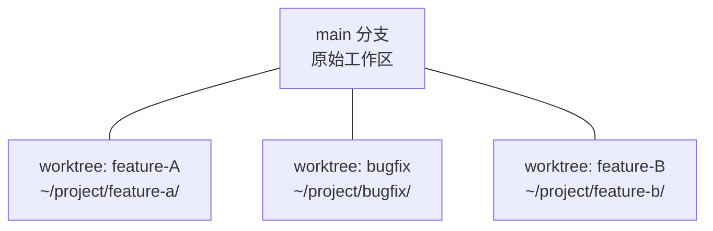
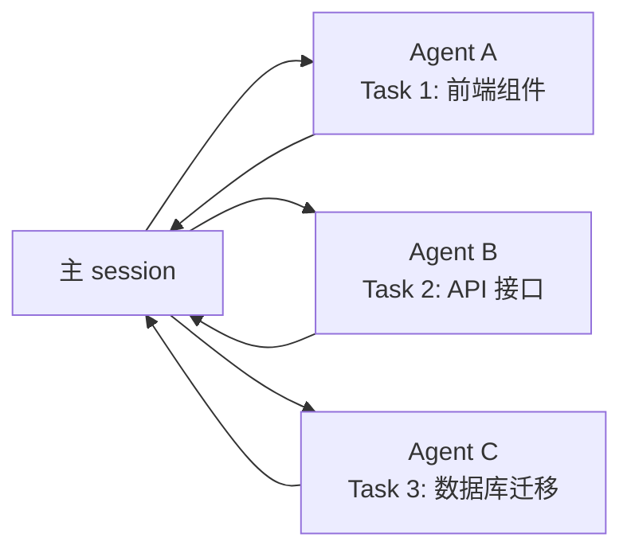
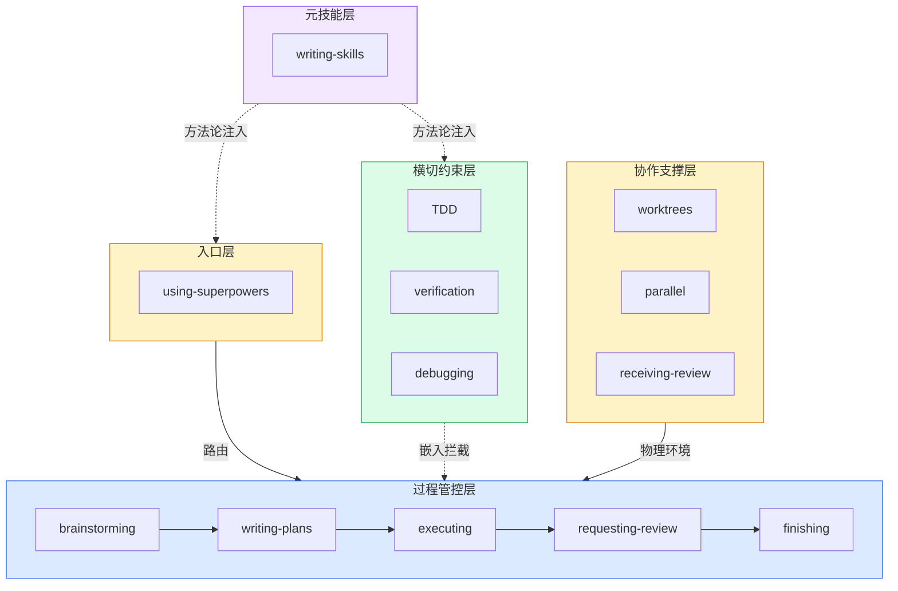

# 第六章：协作支撑 — 基础设施

## 最后一层：不是约束，而是环境

前三层（入口、过程、约束）都是在"告诉 agent 该做什么"。第四层不同——它提供的是**物理环境**：隔离的工作区、并行的能力、反馈响应的规范。

没有这一层，上面的所有流程都可能因为环境混乱而崩溃。

---

## using-git-worktrees — 隔离而非切换

### 解决的问题

```
你正在 feature-A 分支写代码 → 突然需要切回 main 修紧急 bug
→ git stash → checkout main → 修复 → checkout feature-A → pop stash
→ CONFLICT
```

### 核心理念

**不是在不同分支间切换，而是让不同分支同时存在。**



每个 worktree 有独立的工作目录和分支。不需要 stash/checkout/冲突解决。一个终端开一个 worktree，每个 agent 有自己的空间。

### 为什么它是过程链的前置条件

executing-plans 和 subagent-driven-development 都假设有隔离的工作环境。如果没有 worktree：
- 多个 subagent 可能在同一目录写入冲突
- 一个 subagent 的修改会影响另一个
- 上下文污染从"逻辑"层面扩展到"文件系统"层面

---

## dispatching-parallel-agents — 独立任务的并行派发

### 适用条件

两个任务可以并行当且仅当：**无共享状态 + 无顺序依赖**。



### 关键设计：自包含 prompt

并行 agent 不共享上下文。每个 prompt 必须包含该 agent 完成工作所需的**全部信息**。

这看起来"冗余"——但冗余是隔离的必要代价。一个需要共享上下文的任务就不能并行。

---

## receiving-code-review — 技术严谨 > 表面和谐

### 解决的问题

```
收到 code review 反馈 → "好的我改" → 改完发现 reviewer 其实是错的
收到模糊反馈 → 自己猜意思 → 猜错 → 白改
```

### 核心机制

这个 skill 最独特的地方：**它给了 agent "反驳权"**。

```
收到反馈后不是立刻改，而是：
1. 先理解：这条反馈想要解决什么问题？
2. 不清晰？追问到清晰
3. 反馈有问题？用证据反驳（测试结果、文档引用、设计决策）
4. 理解后才开始实现
```

这区别于大多数 agent 的默认行为——"用户说了什么就改什么"。好的工程师不是盲目的执行者——他们对反馈进行技术判断。

---

## 全貌：四层协同



## 你现在知道了什么

1. **四层架构**：入口 → 过程 → 约束 → 协作，每层不同的职责和关系类型
2. **过程管控链**：brainstorming → writing-plans → executing → code-review → finishing，确定性路由
3. **三个铁律**：TDD（无测试不代码）+ verification（无验证不声称）+ debugging（无根因不修复）
4. **八个设计模式**：Iron Law、理性化表、红牌列表、Letter=Spirit、HARD-GATE、CSO、Terminal State、Subagent Isolation
5. **元技能**：writing-skills = TDD for 文档，自指的自洽系统

**Superpowers 的本质**：它不是一套"给 AI 的建议"，而是一个**AI 行为操作系统**——提供了进程调度（入口层）、流水线（过程层）、约束检查（横切层）、资源隔离（协作层），以及编译器（元技能层）。

---

> **延伸阅读**：点击任意 skill 的 [深度文章](/article/writing-skills) 了解单个 skill 的设计细节。或者进入 [Writing Skills 4 章专项](/deep-dive) 深入掌握创建 skill 的方法论。
